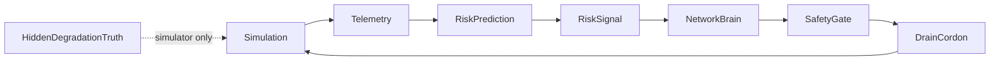
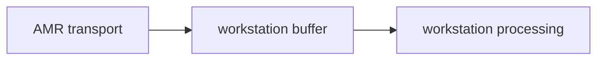
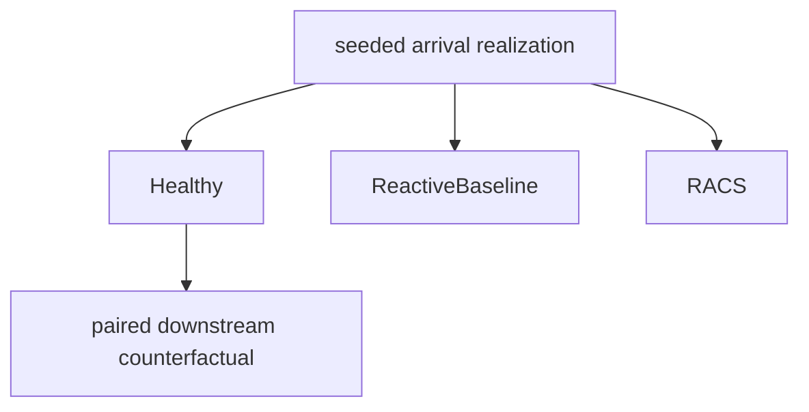

# RACS Protocols — Risk-Aware Coordination System for Autonomous Operations

[](LICENSE)
[](https://www.python.org/downloads/)
[](NIST_ALIGNMENT.md)

RACS is an open risk-aware coordination layer for heterogeneous autonomous
systems.

V1 implements a deterministic warehouse simulation with progressive localized
AMR degradation, observable risk detection, predictive AMR drain/cordon,
downstream propagation modeling, paired healthy counterfactual attribution, and
a 30-seed baseline-versus-RACS robustness evaluation. The reactive baseline uses
the same degradation and workload but waits for hard-failure recovery instead of
predictive intervention.

Primary observed result: RACS improved mean queue AUC and mean latency across
the seeded study, while individual workload realizations included regressions.
H2 was not established: downstream benefit was not greater in the
intervention-before-propagation group than in the at/after-propagation group.
Within the tested WIP levels, greater disturbance-time WIP was associated with a
higher fraction of runs in which RACS intervened before propagation.

Reference result: `results/seeded_robustness_30`

Public tracked reference summary:
`docs/experiments/results/racs_v1_seeded_robustness/`

After creating the fresh-clone environment in Quick Start, run a new
reproduction with a different experiment ID:

```powershell
.\.venv\Scripts\python.exe -m simulations.experiments.racs_v1 `
  --seeds 30 `
  --first-seed 1000 `
  --output results `
  --experiment-id seeded_robustness_30_reproduction
```

Full technical report:
[docs/experiments/racs_v1_seeded_robustness.md](docs/experiments/racs_v1_seeded_robustness.md)

## The Problem

As U.S. logistics and manufacturing operations increasingly depend on autonomous systems — robotic material handling, automated guided vehicles, AI-driven control software — a critical gap has emerged: **individual robots and automation components work reliably in isolation, but fail to coordinate safely as systems.**

This coordination gap produces cascading failures where a localized disruption (a single robot fault, a lane backup, a software misconfiguration) propagates across an entire facility or network. The consequences are severe:

- **$1.4 trillion** in annual losses from unplanned downtime across Fortune 500 companies ([Siemens, 2024](https://www.siemens.com/true-cost-of-downtime))
- **50% higher injury rates** in warehouses with robots vs. without ([Brookings Institution, 2023](https://www.brookings.edu/articles/keeping-workers-safe-in-the-automation-revolution/))
- **$5.4 billion** in losses from a single cascading software failure (CrowdStrike incident, July 2024)

Federal agencies have identified this gap as a national priority:
- **DARPA** launched the [Resilient Supply-and-Demand Networks (RSDN)](https://www.darpa.mil/program/resilient-supply-and-demand-networks) program seeking "agent-based" solutions for supply chain resilience
- The **DOD-funded ARM Institute** issued [Technology Project Call 24-01](https://arminstitute.org/) requesting multi-robot coordination solutions, stating that **"no systems currently exist for dynamic, distributed sensing for safety"**
- **NIST** established the [U.S. AI Safety Institute](https://www.nist.gov/artificial-intelligence/ai-safety-institute) to ensure AI systems in critical infrastructure are robust against cascading failures

Yet no open, vendor-agnostic coordination framework exists for U.S. operators — particularly small and medium enterprises — to adopt.

## What RACS Does

RACS (Risk-Aware Coordination System) is an open-source framework for autonomous
systems to anticipate operational risk, coordinate responses, and reduce
system-level degradation when local disruptions propagate.

### V1 Warehouse Experiment

The V1 seeded robustness experiment compares:

- healthy control: no degradation
- reactive baseline: progressive AMR degradation plus hard-failure recovery
- RACS: same degradation plus predictive risk-aware drain/cordon and identical
  hard-failure fallback

Architecture:



Task flow:



Experiment lifecycle:



Reference results and plots are tracked under:

- `docs/experiments/results/racs_v1_seeded_robustness/`
- `docs/experiments/figures/racs_v1/`

Reference and reproduction paths:

- frozen original reference: `results/seeded_robustness_30`
  - local run used to produce the committed figures
  - full directory is intentionally untracked
- public compact reference:
  `docs/experiments/results/racs_v1_seeded_robustness/`
  - summary/provenance only
  - not sufficient to regenerate all six figures
- fresh reproduction: `results/seeded_robustness_30_reproduction`

New reproductions must use a different `--experiment-id` and must not overwrite
the frozen original reference.

Generate plots from the fresh reproduction output:

```powershell
.\.venv\Scripts\python.exe -m simulations.experiments.plot_racs_v1 `
  --result-dir results\seeded_robustness_30_reproduction `
  --output-dir docs\experiments\figures\racs_v1_reproduction
```

### Architecture

RACS uses a two-layer architecture:

**Layer 1 — Site Agents** (per-facility)  
Each facility runs a local Site Agent that:
- Connects to robots and automation systems via vendor-agnostic interfaces
- Generates real-time risk signals (congestion probability, failure likelihood, recovery latency) using ML models (XGBoost/LightGBM)
- Executes local coordination decisions (task redistribution, controlled slowdowns)
- Enforces hard safety constraints with human override capability

**Layer 2 — Network Brain** (cross-facility)  
A coordination layer subscribes to risk signals from all Site Agents and:
- Computes cross-site capacity and workload balance
- Detects elevated operational risk before or during propagation
- Issues coordination commands to redistribute work across facilities
- Maintains complete audit trail of all decisions

### Key Principles

1. **Risk-Aware by Default**: Every coordination decision incorporates predictive risk signals — not just current state
2. **Safety as a Hard Constraint**: Safety limits (speed, zones, e-stop) cannot be overridden by optimization. Human override is always available.
3. **Vendor-Agnostic**: Protocol specifications use open standards (JSON Schema, Apache Kafka, ROS 2 compatible) — no vendor lock-in
4. **Graceful Degradation**: When faults occur, the system degrades to a known safe state rather than failing unpredictably
5. **Auditable**: Every decision is logged with full context for post-incident analysis and regulatory compliance
6. **Decentralized Resilience**: No single point of failure — if the Network Brain fails, each Site Agent continues operating autonomously in safe mode

## Quick Start

```powershell
git clone https://github.com/ridwanbale/racs-protocols
cd racs-protocols
python -m venv .venv
Set-ExecutionPolicy -Scope Process -ExecutionPolicy Bypass
.\.venv\Scripts\python.exe -m pip install --upgrade pip
.\.venv\Scripts\python.exe -m pip install -e ".[dev]"
.\.venv\Scripts\python.exe examples\quickstart.py
.\.venv\Scripts\python.exe -m pytest tests\ -q -p no:cacheprovider
```

### Minimal example

```python
from racs.risk.predictor import RiskPredictor
from racs.risk.risk_signals import TelemetryInput
from racs.safety.constraints import SafetyConfig, SafetyGate

# Describe your facility's current state
telemetry = TelemetryInput(
    site_id="WAREHOUSE_1",
    queue_length=45,
    robot_active_count=12,
    robot_fault_count=2,
    throughput_rate=0.73,
    error_rate_5min=0.08,
)

# Predict risk
predictor = RiskPredictor()
signal = predictor.predict(telemetry)
print(f"Risk level: {signal.level.value} (score={signal.composite_score:.2f})")
# Risk level: HIGH (score=0.71)

# Evaluate a coordination action
gate = SafetyGate(SafetyConfig.default())
result = gate.evaluate({
    "type": "redistribute_tasks",
    "target_site_robot_density": 0.70,
    "robot_speed_ms": 1.5,
    "target_fault_ratio": 0.05,
    "risk_score": signal.composite_score,
})
print(f"Action allowed: {result.allowed} — {result.reason}")
```

## Simulation Scenarios

RACS includes pre-built simulation scenarios demonstrating coordination under stress:

| Scenario | What It Tests | Key Metric |
|----------|--------------|------------|
| `lane_backup` | Congestion at one facility triggers cross-site load rebalancing | Cascade containment time |
| `robot_failure` | Single robot fault with coordinated recovery | Recovery time, safety violations |
| `demand_spike` | Sudden demand surge requiring multi-site response | Throughput maintenance % |
| `network_partition` | Communication failure between sites | Autonomous safe-state transition |
| `crowdstrike_scenario` | Centralized update failure affecting multiple sites | Decentralized resilience score |

Run a scenario:
```powershell
.\.venv\Scripts\python.exe simulations\scenarios\crowdstrike_scenario.py
```

## Benchmarks

The current V1 benchmark is the seeded robustness experiment documented in
[docs/experiments/racs_v1_seeded_robustness.md](docs/experiments/racs_v1_seeded_robustness.md).
Legacy scenario demonstrations may exist in the repository, but the published
V1 claims are limited to the tracked seeded robustness artifacts.

## NIST AI Risk Management Framework Alignment

RACS is designed to align with all four functions of the [NIST AI RMF 1.0](https://www.nist.gov/itl/ai-risk-management-framework):

| NIST Function | RACS Implementation |
|---------------|-------------------|
| **GOVERN** | Safety constraints are policy-level YAML configurations, not code-level decisions |
| **MAP** | Risk signals are explicitly categorized by type, severity, and confidence |
| **MEASURE** | Standardized experiments measure recovery time, containment, and paired degradation deltas |
| **MANAGE** | Human override, controlled degradation, and audit logging |

See [NIST_ALIGNMENT.md](NIST_ALIGNMENT.md) for detailed mapping.

## Repository Structure

```
racs-protocols/
├── racs/                        # Core library
│   ├── agents/                  # Site Agent and Network Brain
│   ├── risk/                    # Risk prediction and cascade detection
│   ├── coordination/            # Task allocation, load balancing, recovery
│   ├── safety/                  # Constraints, human override, degradation, audit
│   └── protocols/               # Kafka events, ROS 2 mappings, JSON Schemas
├── simulations/                 # Multi-warehouse simulation + scenarios
├── benchmarks/                  # Standardized benchmark suite
├── examples/                    # Quickstart and demos
├── tests/                       # Test suite (pytest)
└── docs/                        # Protocol spec, safety playbook, deployment guide
```

## Running Tests

```powershell
.\.venv\Scripts\python.exe -m pytest tests\ -q -p no:cacheprovider
```

## Related Work

- Bale, R.I. et al. (2026). "Integration of Digital Twin Platforms with Machine Learning Models for Early Detection of Project Delays and Cost Overruns." *Asian Journal of Advanced Research and Reports*, 20(1), 332–349.
- NIST AI 100-1: AI Risk Management Framework 1.0 (January 2023)
- DARPA Resilient Supply-and-Demand Networks (RSDN) Program
- ARM Institute Technology Project Call 24-01: Multi-Robot and Multi-Human Collaboration

## Contributing

Contributions are welcome. Please open an issue to discuss your proposed change before submitting a pull request.

## License

Apache License 2.0 — see [LICENSE](LICENSE) for details.

## Author

**Ridwan Ishola Bale**  
MS Engineering, Purdue University | MS Engineering with Finance, University of Kent  
Independent researcher in risk-aware AI coordination for autonomous logistics systems
