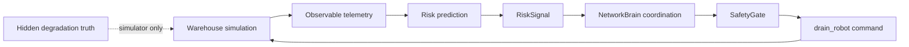
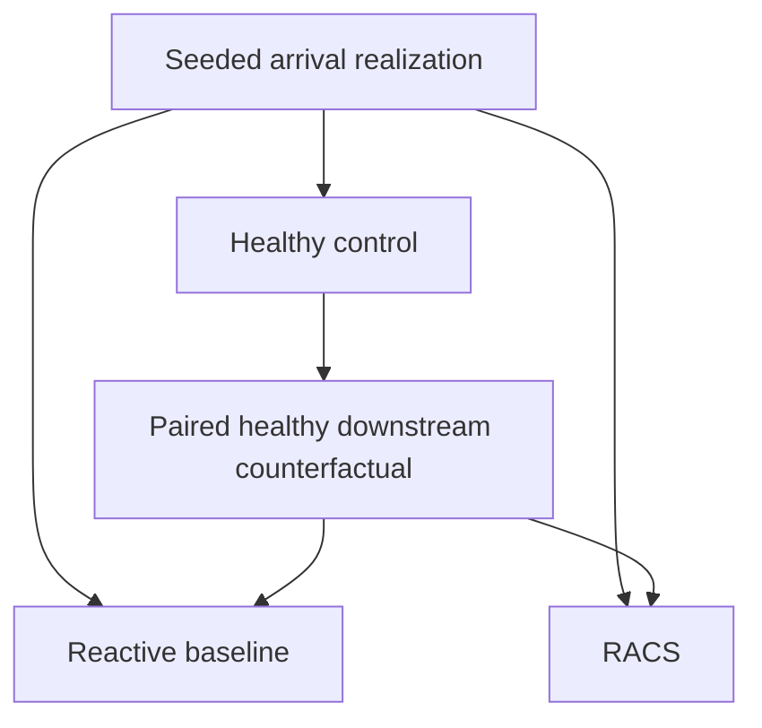

# RACS V1 Seeded Robustness Experiment

This document is the technical reference for the frozen RACS V1 seeded
robustness experiment.

Source snapshot:
`b4764da6193e013c3c2e1f86763597498bc6253f`

Frozen result directory:
`results/seeded_robustness_30`

Reference summary artifacts:
`docs/experiments/results/racs_v1_seeded_robustness/`

Reference/reproduction distinction:

- REFERENCE RESULT: `results/seeded_robustness_30`
  - local run used to produce the committed figures
  - full directory is intentionally untracked
- PUBLIC TRACKED REFERENCE SUMMARY:
  `docs/experiments/results/racs_v1_seeded_robustness/`
  - summary/provenance only
  - not sufficient to regenerate all six figures
- NEW REPRODUCTION: must use a different `--experiment-id`

## Research Question

Can a risk-aware coordination layer detect emerging AMR degradation and
coordinate recovery before or during propagation into downstream operations?

The experiment evaluates whether predictive RACS coordination changes transport
and downstream workstation outcomes relative to an otherwise equivalent
reactive baseline.

## Architecture



RACS cannot inspect hidden simulator truth such as the configured degrading
robot, degradation rate, hidden service capacity, future hard-failure step, or
failure threshold. The predictive path uses observable telemetry, risk signals,
suspect-robot anomaly attribution, NetworkBrain policy, SafetyGate validation,
and an explicit predictive drain command.

The downstream propagation model is:


## Experimental Conditions

For every seed and WIP level, three paired conditions are run:



Healthy:
- no progressive degradation
- no predictive RACS intervention

Reactive baseline:
- same workload and workstation state
- progressive degradation enabled
- conventional recovery only after hard failure

RACS:
- same degradation as baseline
- predictive risk-aware drain/cordon enabled
- identical hard-failure fallback mechanics

## Frozen Scenario Configuration

Core simulation:

```text
steps = 60
step_duration_s = 10
site_ids = ("SITE_A",)
robot_count = 4
base_service_steps = 4
task_deadline_steps = 16
```

Workload:

```text
arrival mode = seeded_timing
total task arrivals = 51
tasks_per_step target = 0.85
max arrivals per step = 2
seeds = 1000..1029
```

Downstream workstation:

```text
workstation processing rate = 0.85 units/step
disturbance-time WIP levels = 0, 1, 2, 4
```

Degradation:

```text
degrading robot = SITE_A_R000
degradation start step = 15
degradation rate = 0.1 capacity units/step
minimum service capacity = 0.2
hard failure threshold = 0.2
```

RACS policy:

```text
intervention risk level = MEDIUM
robot anomaly threshold = 1.0
coordination action = predictive drain/cordon
```

Predictive drain means:

1. stop assigning new tasks to the suspect robot
2. allow its current task to continue
3. quarantine/remove it from assignment after the current task completes
4. use the same hard-failure fallback recovery as baseline if hard failure
   occurs first

## Pairing Design

For every seed/WIP pair, healthy, baseline, and RACS share:

- arrival count at every step
- total task arrivals
- workstation WIP preconditioning
- workstation processing cadence
- robot/service configuration
- simulation duration

Baseline and RACS additionally share:

- degrading robot
- degradation start
- degradation trajectory
- counterfactual hard-failure step

The intended treatment difference is the coordination response: reactive
hard-failure recovery versus predictive risk-aware drain with the same fallback.

## Metrics

Transport:

- `tasks_completed`: transport tasks completed by AMRs
- `queue_auc`: sum of queued transport tasks across steps; lower is better
- `average_completion_latency`: mean completed step minus created step; lower
  is better

Raw downstream:

- `workstation_starvation_steps`: raw steps where the workstation had processing
  entitlement but insufficient input
- `missed_workstation_processing_units`: raw missed processing entitlement
- raw starvation is not causal attribution by itself

Paired causal downstream metrics:

- `degradation_induced_cascade_start_step`: first post-onset step where the
  degraded condition misses workstation processing that paired healthy does not
- `cumulative_positive_excess_missed_processing_units`: positive-only excess
  missed processing; used for onset/event attribution
- `net_missed_workstation_processing_deficit_vs_healthy`: signed net missed
  processing delta; positive means the degraded condition lost more workstation
  opportunities overall than paired healthy
- `downstream_completion_deficit_vs_healthy`: healthy downstream completions
  minus condition downstream completions; positive means the condition is behind
  healthy

Timing:

- `risk_detection_step`
- `intervention_step`
- `counterfactual_failure_step`
- `intervention_to_baseline_propagation_margin` =
  baseline degradation-induced cascade start step minus RACS intervention step

Sign convention for paired deltas:

- `RACS - baseline`
- completed-task delta: positive favors RACS
- queue, latency, and loss deltas: negative favors RACS

## Hypotheses

H1: RACS improves transport coordination across workload timing variation.

H2: RACS reduces downstream degradation impact more when intervention precedes
propagation.

H3: Greater disturbance-time WIP increases the probability that RACS acts before
propagation.

## Results

The result summary below is derived from the frozen artifacts in
`results/seeded_robustness_30`; no simulation rerun was performed.

### Intervention Before Propagation

| WIP | Fraction |
| --- | ---: |
| 0 | 0.6667 |
| 1 | 0.8000 |
| 2 | 0.9333 |
| 4 | 0.9333 |

### Baseline Cascade Start Distributions

| WIP | Min | Median | Max |
| --- | ---: | ---: | ---: |
| 0 | 16 | 24.0 | 38 |
| 1 | 16 | 25.0 | 38 |
| 2 | 17 | 28.5 | 45 |
| 4 | 24 | 44.0 | 59 |

Seeded arrival timing breaks the single deterministic phase-locked propagation
time observed in the canonical deterministic scenario.

### Mean RACS - Baseline Deltas

Across all WIP levels, the WIP summary reports:

```text
queue AUC delta = -2.933333
latency delta = -0.090067
net downstream deficit delta = -0.133333
```

Negative queue, latency, and loss deltas favor RACS.

RACS worsened queue AUC in 24 / 120 paired conditions. This is retained as a
negative result.

At WIP 4, one paired case had a baseline degradation-induced cascade while the
paired RACS run did not. This is an observed case, not the general result.

### Hypothesis Status

H1: PARTIALLY SUPPORTED.

RACS improved mean queue AUC and mean latency across the seeded study, while
individual workload realizations included regressions.

H2: NOT ESTABLISHED.

H2 was not established: downstream benefit was not greater in the
intervention-before-propagation group than in the at/after-propagation group.

H3: SUPPORTED.

Within the tested WIP levels, greater disturbance-time WIP was associated with a
higher fraction of runs in which RACS intervened before propagation:

```text
WIP 0 -> 66.7%
WIP 1 -> 80.0%
WIP 2 -> 93.3%
WIP 4 -> 93.3%
```

## Figures

Generated figures are stored in:
`docs/experiments/figures/racs_v1/`

- `queue_auc_delta_distribution.png`
- `latency_delta_distribution.png`
- `intervention_before_propagation_by_wip.png`
- `baseline_cascade_timing_by_wip.png`
- `downstream_net_deficit_delta_distribution.png`
- `representative_timeline.png`

Representative timeline seed selection rule:

```text
Choose the seed closest to median baseline queue AUC at WIP 2;
break ties by lowest seed.
```

The selected representative case is seed 1012 at WIP 2.

The frozen trial CSV does not include every drain-subevent column that later
source output can expose, so the timeline shows the events available in the
frozen result artifact rather than rerunning the simulation.

## Reproduction

Fresh Windows PowerShell setup:

```powershell
python -m venv .venv
Set-ExecutionPolicy -Scope Process -ExecutionPolicy Bypass
.\.venv\Scripts\python.exe -m pip install --upgrade pip
.\.venv\Scripts\python.exe -m pip install -e ".[dev]"
```

From the source snapshot, run:

```powershell
.\.venv\Scripts\python.exe -m simulations.experiments.racs_v1 `
  --seeds 30 `
  --first-seed 1000 `
  --output results `
  --experiment-id seeded_robustness_30_reproduction
```

Do not reuse `seeded_robustness_30`; new reproductions must use a different
`--experiment-id` and must not overwrite the frozen reference result.

The plotter requires `paired_results.csv`, `trials.csv`, and
`wip_summary.csv`. The compact tracked reference summary under
`docs/experiments/results/racs_v1_seeded_robustness/` does not contain all of
those inputs and cannot regenerate all six figures by itself.

Generate plots from the fresh reproduction output:

```powershell
.\.venv\Scripts\python.exe -m simulations.experiments.plot_racs_v1 `
  --result-dir results\seeded_robustness_30_reproduction `
  --output-dir docs\experiments\figures\racs_v1_reproduction
```

Exact reproduction conditions:

```text
seed range = 1000..1029
WIP = 0, 1, 2, 4
total arrivals = 51
max burst = 2
arrival mode = seeded_timing
```

## Provenance

Original runtime manifest HEAD:

```text
395e238c62d2e0f7c2439b6d83486d5279e5380a
```

The experiment was executed from a dirty working tree. The final source snapshot
commit records that implementation:

```text
b4764da6193e013c3c2e1f86763597498bc6253f
```

Dirty-tree diff SHA-256:

```text
7610033FB020FA9C5B6DDA4059A39EAEE82C9785C6F93B8F924BFCA77362C4F5
```

See:
`docs/experiments/results/racs_v1_seeded_robustness/provenance.json`

## Limitations

- simplified discrete-event warehouse model
- service-capacity degradation rather than physical locomotion dynamics
- single degrading robot
- single-site experiment
- deterministic robot service duration
- workstation abstraction
- only arrival timing randomized
- 30 seeds with descriptive statistics only
- no statistical significance claims
- no ROS 2, Gazebo, or physical robot validation
- H2 is unsupported / not established in this run
- some RACS runs worsen queue AUC
- downstream effect size is small

## Scientific Integrity

- WIP levels were pre-specified
- seed range was fixed
- negative results were retained
- RACS detector, anomaly mapping, policy threshold, and drain semantics were
  frozen before this robustness study
- no post-hoc threshold tuning was performed
- paired healthy counterfactuals were used for causal downstream attribution

## Interpretation

The V1 seeded robustness experiment demonstrates predictive coordination before
hard AMR failure and shows average transport-level queueing and latency
improvements under workload-timing variation.

Downstream resilience increases the amount of time available for predictive
intervention. However, intervention occurring before propagation did not
consistently produce larger downstream-loss reductions in this V1 experiment.
